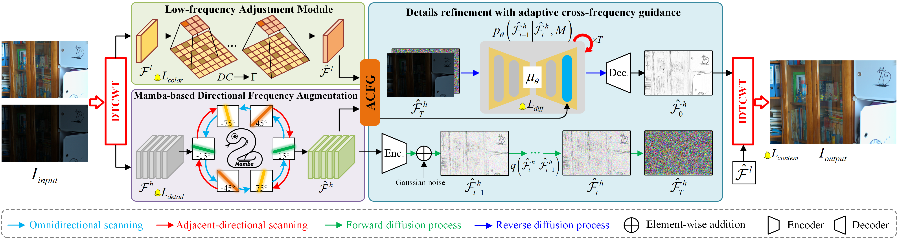

# DFA-Net: An Efficient Diffusion With Directional Frequency Feature Augmentation for Low-Light Image Enhancement
This is the official code for **DFA-Net: An efficient diffusion with frequency directional feature augmentation for low-light image enhancement**.

## Pipeline


## Abstract
Existing diffusion-based low-light image enhancement (LLIE) methods have achieved remarkable restoration quality at the cost of substantial computational complexity, limiting their practical deployment. To address this challenge, we propose an efficient Diffusion-based Frequency Augmentation Network (DFA-Net), which exploits the compact representation of image structures in the frequency domain for efficient restoration. Our key insight reveals that directional frequency features are pivotal for accurate texture restoration in LLIE. Capitalizing on this, we propose a novel Mamba-based Directional Feature Augmentation (MDFA) module that efficiently enhances frequency-domain features while significantly reducing both computational complexity and parameter count. Subsequently, a frequency diffusion refinement is proposed to suppress amplified noise while preserving fine-grained details. Unlike existing diffusion-based solutions, we suggest dynamically balancing color restoration and artifact suppression through an adaptive interaction between high- and low-frequency components, \ie, the adaptive cross-frequency guidance. Extensive experiments demonstrate that DFA-Net achieves state-of-the-art performance on public benchmarks with a minimal parameter footprint—utilizing only 9.25\% of the parameters and 20.71\% fewer computational costs compared to prevailing diffusion-based LLIE methods. The practical utility of DFA-Net is further validated through a low-light face detection application.

## Download the project.
Please run the following command to ensure that you deploy our project locally.

```python
git clone https://github.com/CodeSet1/DFA-Net.git
```

## Dependencies
```
pip install torch==2.0.1 torchvision==0.15.2 torchaudio==2.0.2 --index-url https://download.pytorch.org/whl/cu118
```

Download these two files from the following links and upload them to the server, and then install:  
Note: find the corresponding veresion
1. [causal_conv1d](https://github.com/Dao-AILab/causal-conv1d/releases/tag/v1.0.0)
`causal_conv1d-1.0.0+cu118torch2.0cxx11abiFALSE-cp39-cp39-linux_x86_64.whl`
2. [mamba_ssm](https://github.com/state-spaces/mamba/releases/tag/v1.0.1)
`mamba_ssm-1.0.1+cu118torch2.0cxx11abiFALSE-cp39-cp39-linux_x86_64.whl`  
you can also download them easily [here](https://drive.google.com/drive/folders/1lsb6MfmGF8OmhqaishnBc69TFNxsabHP)
Please note that you may encounter network issues during the installation of `causal_conv1d` and `mamba_ssm`, which could cause the process to continuously hang at `Building wheel for mamba ssm (setup.py).` Therefore, please download the `.whl` files from [Baidu Netdisk](https://pan.baidu.com/s/1ko_q8WlaagqxZVG-3M3zyg?pwd=0325)  or [Google Drive](https://drive.google.com/drive/folders/1IKsjCBSRgcdvYkiqQnGWsqGEbefFV3zI?usp=sharing) and copy them locally. Then, run the following command for manual installation.

```
pip install causal_conv1d-1.0.0+cu118torch2.0cxx11abiFALSE-cp39-cp39-linux_x86_64.whl  
pip install mamba_ssm-1.0.1+cu118torch2.0cxx11abiFALSE-cp39-cp39-linux_x86_64.whl
```

```
pip install -r requirements.txt
```

## Datasets
The LOLv1 datasets can be downloaded from this [link](https://drive.google.com/file/d/1L-kqSQyrmMueBh_ziWoPFhfsAh50h20H/view). 
The LOLv2 datasets can be downloaded from this [link](https://drive.google.com/file/d/1Ou9EljYZW8o5dbDCf9R34FS8Pd8kEp2U/view).
Please refer to [[Project Page of RetinexNet.]](https://daooshee.github.io/BMVC2018website/)

## Pretrained Weights
The pretrained model, `DFA-Net.pth`, which can reproduce the quantitative results in the paper, is in the `weights` directory. We will organize and upload it as soon as possible.


## How to train?
You need to modify ```datasets/dataset.py``` slightly for your environment, and then
```
python train.py  
```

## How to test?
```
python evaluate.py
```
## Visual comparison


### 7.Acknowledgments

We thank the following article and the authors  for their open-source codes.

```
@inproceedings{Retinexmamba,
	title={Retinexmamba: Retinex-based Mamba for Low-light Image Enhancement},
	author={Jiesong Bai and Yuhao Yin and Qiyuan He and Yuanxian Li and Xiaofeng Zhang},
	booktitle={International Conference on Neural Information Processing (ICONIP)},
	year={2024}
}

@article{DiffLL,
author = {Jiang, Hai and Luo, Ao and Fan, Haoqiang and Han, Songchen and Liu, Shuaicheng},
title = {Low-Light Image Enhancement with Wavelet-Based Diffusion Models},
year = {2023},
journal = {ACM Trans. Graph.},
articleno = {238},
numpages = {14}
}
```
